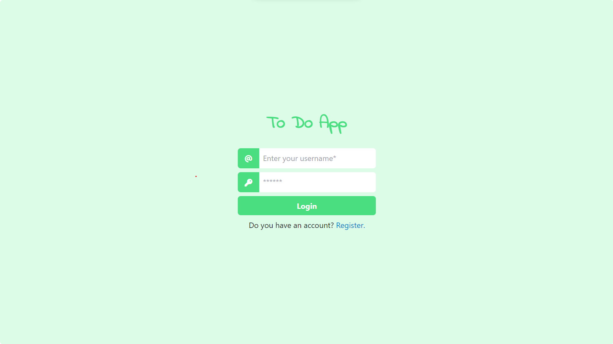

# To Do APP

This the current personal project that I'm building.
The app will later be posted for free on Heroku.

I'm adding functionality to the page, and at the moment the login/register system is working and it's also possible to view the lists created on the admin page on the side menu of the app. Also, the first list is shown on the home page automatically.

Things that need to be done:
- work on the state management
- add functionality when creating a new list from the side menu
- add functionality when creating a new task on the home page
- display a task modal to be able to edit the task
- update the user profile info on the nav bar and on the side menu

## Tools being used?

React.js, Tailwindcss, Django, Heroku

## Images of the project

### Login & Register pages

### Home Page

### Side Menu

